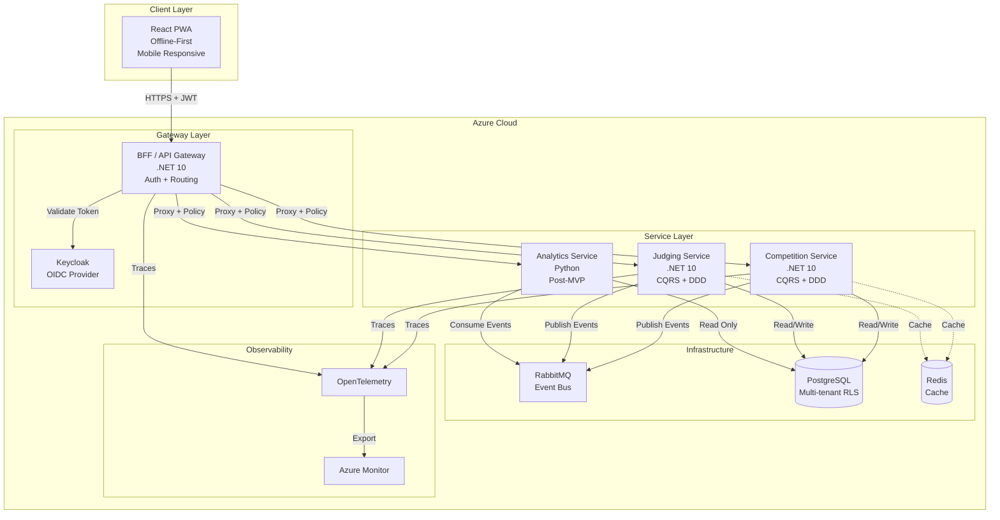

# Beer Competition SaaS - Architecture Overview

## Executive Summary

Multi-tenant SaaS platform for managing BJCP 2021-compliant homebrew beer competitions with blind judging, conflict-of-interest enforcement, and accurate scoring. Supports 200+ entrants, 50+ concurrent judges, 600+ bottles per competition with strict multi-tenant data isolation.

**Key Architectural Principles:**
- **Multi-tenancy**: Strict data isolation using PostgreSQL Row-Level Security (RLS)
- **Event-Driven**: Asynchronous communication via RabbitMQ with CloudEvents format
- **Microservices**: Domain-driven service boundaries (Competition, Judging, Analytics)
- **CQRS Pattern**: Command/Query separation using MediatR
- **Offline-First Frontend**: PWA with IndexedDB for judge scoresheets
- **Observability**: OpenTelemetry with distributed tracing

---

## Technology Stack

### Backend Services
- **.NET 10 (C#)**: Competition Service, Judging Service, BFF/API Gateway
  - MediatR for CQRS
  - Entity Framework Core with PostgreSQL
  - Outbox pattern for transactional event publishing
- **Python 3.12**: Analytics Service (Post-MVP)
  - FastAPI for REST APIs
  - scikit-learn for ML (judge assignment optimization)

### Authentication & Authorization
- **Keycloak**: OIDC/OAuth2 identity provider
- **Roles**: Organizer, Judge, Entrant, Steward
- **BFF Pattern**: .NET API Gateway handles token validation and role enforcement

### Infrastructure
- **Database**: PostgreSQL with Row-Level Security (RLS) for multi-tenancy
- **Message Bus**: RabbitMQ with topic exchanges
- **Cache**: Redis (sessions, scoresheets, leaderboards)
- **Orchestration**: Docker Compose → Azure Container Apps
- **Observability**: OpenTelemetry → Azure Monitor / Application Insights

### Frontend
- **React 18**: Component-based UI with TypeScript
- **Tailwind CSS**: Mobile-first responsive design
- **PWA**: Offline scoresheet entry with Service Workers + IndexedDB
- **State Management**: TanStack Query (server state) + Zustand (client state)

### CI/CD & IaC
- **GitHub Actions**: Build, test, deploy pipelines
- **Azure Container Registry**: Docker image storage
- **Bicep**: Infrastructure-as-Code for Azure resources
- **Testcontainers**: Integration tests with real PostgreSQL/RabbitMQ

---

## System Architecture



---

## Service Boundaries (Domain-Driven Design)

### 1. Competition Service (.NET 10)
**Domain**: Competition management, entry registration, payments, bottle tracking

**Key Responsibilities:**
- Competition lifecycle (CRUD, state transitions: DRAFT → OPEN → JUDGING → COMPLETE)
- Entry submissions with anonymous judging number generation
- Payment processing (Stripe integration)
- Entry label generation (PDF with QR code, no brewer info)
- Bottle check-in tracking
- BJCP 2021 style catalog
- Results publication

**Events Published:**
- `competition.created`
- `entry.submitted`
- `entry.paid`
- `bottles.checked_in`
- `results.published`

**Events Consumed:**
- `scoresheet.submitted` (scoring progress tracking)
- `consensus.completed` (final score updates)
- `bos.completed` (Best of Show rankings)

**Database Tables Owned:**
- Tenants, Users, Competitions, Entries, Styles, BottleReception, Payments, Notifications, EventStore

---

### 2. Judging Service (.NET 10)
**Domain**: Flight management, scoresheet entry, judging workflows, Best of Show

**Key Responsibilities:**
- Flight creation and entry assignment (max 10 entries/flight)
- Conflict-of-interest validation (judges cannot judge their own entries)
- Scoresheet submission (BJCP 2021 scoring: Aroma 12, Appearance 3, Flavor 20, Mouthfeel 5, Overall 10)
- Score aggregation (consensus scoring)
- Best of Show (BOS) rounds and voting
- Placement calculation (mini-BOS per category)

**Events Published:**
- `flight.created`
- `judge.assigned`
- `scoresheet.submitted`
- `consensus.completed`
- `bos.completed`

**Events Consumed:**
- `entry.paid` (build eligible entry pool for flights)
- `bottles.checked_in` (validate physical availability)

**Database Tables Owned:**
- Flights, FlightEntries, JudgesFlights, Scoresheets, BOSCandidates, BOSFlights

---

### 3. Analytics Service (Python - Post-MVP)
**Domain**: Reporting, ML-driven insights, advanced analytics

**Key Responsibilities:**
- Competition dashboards (entry trends, judge workload)
- ML-powered judge assignment suggestions (minimize conflicts, balance BJCP ranks)
- Scoresheet anomaly detection (identify outlier scores)
- Historical competition reports
- Data aggregation pipelines

**Events Consumed:**
- All events from Competition and Judging services

**Technology:**
- FastAPI for REST APIs
- pandas for data processing
- scikit-learn for ML models
- Jupyter notebooks for exploratory analysis

---

## Multi-Tenancy Strategy

### Implementation
- **Tenant ID**: UUID present in all tables (except global reference data like Styles)
- **PostgreSQL Row-Level Security (RLS)**: Database-enforced isolation
  ```sql
  CREATE POLICY tenant_isolation ON competitions
  USING (tenant_id = current_setting('app.current_tenant')::uuid);
  ```
- **Entity Framework Global Filter**: ORM automatically injects `tenant_id` predicate
  ```csharp
  modelBuilder.Entity<Competition>()
      .HasQueryFilter(c => c.TenantId == _tenantProvider.CurrentTenantId);
  ```
- **BFF Injection**: API Gateway extracts `tenant_id` from JWT and passes as `X-Tenant-ID` header

### Guarantees
- No cross-tenant data access
- Shared infrastructure with hard data boundaries
- Tenant context propagated through entire request lifecycle

---

## Authentication Flow (Keycloak + BFF)

1. **Login Request**: User navigates to `/login`
2. **Redirect to Keycloak**: BFF redirects to Keycloak (OIDC Authorization Code flow)
3. **User Authentication**: User enters credentials; Keycloak validates
4. **Token Exchange**: BFF exchanges authorization code for JWT (access + refresh tokens)
5. **Session Establishment**: BFF stores tokens securely (HTTP-only cookie or Redis)
6. **Authenticated Requests**: API calls include JWT in `Authorization: Bearer <token>` header
7. **Token Validation**: BFF validates JWT signature, expiry, roles
8. **Role Enforcement**: BFF checks user has required role before proxying to microservices
9. **Service-to-Service**: Microservices trust BFF; BFF injects tenant + user claims

---

## Event-Driven Architecture

### Event Bus: RabbitMQ
- **Topic Exchanges**: Route events by type (e.g., `competition.created`, `entry.submitted`)
- **Durable Queues**: Guaranteed delivery with persistent messages
- **Dead Letter Queue (DLQ)**: Failed messages moved to DLQ for manual review
- **Outbox Pattern**: Transactional event publishing
  1. Command writes to DB + EventStore table in same transaction
  2. Background worker reads EventStore and publishes to RabbitMQ
  3. Marks event as published in DB

### Event Format: CloudEvents 1.0
```json
{
  "specversion": "1.0",
  "type": "com.beercomp.entry.submitted",
  "source": "/services/competition",
  "id": "uuid",
  "time": "2025-12-19T10:00:00Z",
  "datacontenttype": "application/json",
  "data": {
    "tenant_id": "uuid",
    "competition_id": "uuid",
    "entry_id": "uuid",
    "judging_number": 42,
    "style_id": "21A"
  }
}
```

### Key Events
- **competition.created**: New competition created
- **entry.submitted**: Beer entry registered
- **entry.paid**: Payment confirmed
- **bottles.checked_in**: Physical bottles received
- **scoresheet.submitted**: Judge completes scoresheet
- **consensus.completed**: Final score agreed
- **bos.completed**: Best of Show winner selected

---

## CQRS Pattern (MediatR)

### Command Example: Create Competition
```csharp
// Command
public record CreateCompetitionCommand(
    string Name,
    DateTime RegistrationDeadline,
    DateTime JudgingStartDate
) : IRequest<Result<Guid>>;

// Handler
public class CreateCompetitionHandler : IRequestHandler<CreateCompetitionCommand, Result<Guid>>
{
    public async Task<Result<Guid>> Handle(CreateCompetitionCommand cmd, CancellationToken ct)
    {
        // 1. Validate business rules
        // 2. Create domain entity
        var competition = Competition.Create(cmd.Name, cmd.RegistrationDeadline, cmd.JudgingStartDate);
        
        // 3. Persist to DB
        await _dbContext.Competitions.AddAsync(competition, ct);
        
        // 4. Store event in Outbox
        await _dbContext.EventStore.AddAsync(new CompetitionCreatedEvent(competition.Id), ct);
        
        // 5. Commit transaction
        await _dbContext.SaveChangesAsync(ct);
        
        return Result.Success(competition.Id);
    }
}
```

### Query Example: Get Competition Details
```csharp
// Query
public record GetCompetitionQuery(Guid CompetitionId) : IRequest<Result<CompetitionDto>>;

// Handler
public class GetCompetitionHandler : IRequestHandler<GetCompetitionQuery, Result<CompetitionDto>>
{
    public async Task<Result<CompetitionDto>> Handle(GetCompetitionQuery query, CancellationToken ct)
    {
        var competition = await _dbContext.Competitions
            .AsNoTracking()
            .Include(c => c.Entries)
            .FirstOrDefaultAsync(c => c.Id == query.CompetitionId, ct);
        
        return competition == null 
            ? Result.Failure<CompetitionDto>("Competition not found")
            : Result.Success(competition.ToDto());
    }
}
```

---

## Observability (OpenTelemetry)

### Distributed Tracing
1. **Request Entry**: User submits scoresheet via React app
2. **BFF Span**: BFF creates root span with `trace_id`
3. **Context Propagation**: BFF injects `traceparent` header when calling Judging Service
4. **Service Span**: Judging Service creates child span for scoresheet validation
5. **Database Span**: EF Core creates span for DB insert
6. **Event Span**: RabbitMQ publish creates span
7. **Export**: All spans exported to OpenTelemetry Collector → Azure Monitor

### Key Metrics
- **Request Duration**: p50, p95, p99 latency per endpoint
- **Error Rate**: HTTP 5xx responses by service
- **Event Bus Queue Depth**: Messages pending in RabbitMQ
- **Database Connection Pool**: Active/idle connections

### Alerts
- Latency > 2s for 5 minutes → PagerDuty alert
- Error rate > 5% → Slack notification
- Queue depth > 1000 → Email to DevOps

---

## Data Model (High-Level)

### Core Entities

**Tenants** (Organizations)
- Multi-tenant root entity
- Subscription tier (FREE, PRO, ENTERPRISE)

**Users** (Keycloak Integration)
- Email, full name, BJCP rank
- Roles: ORGANIZER, JUDGE, ENTRANT, STEWARD
- Mapped to Keycloak `sub` claim

**Competitions**
- Name, registration deadline, judging dates
- Status: DRAFT → OPEN → JUDGING → COMPLETE
- Owned by Tenant

**Entries** (Beer Submissions)
- `entry_id`: Public ID shown to brewer
- `judging_number`: Anonymous ID for judges (1, 2, 3...)
- Beer name, style, special ingredients
- Payment status, bottle status

**Styles** (BJCP 2021 Catalog)
- Global reference data (no tenant_id)
- Style ID (1A, 21A...), name, description

**Flights** (Judging Tables)
- Max 10 entries per flight
- Scheduled time, status
- Assigned judges (max 3)

**Scoresheets** (BJCP Scoring)
- Aroma: 0-12, Appearance: 0-3, Flavor: 0-20, Mouthfeel: 0-5, Overall: 0-10
- Total: 0-50 points
- Descriptors, flavor notes, feedback

**BOS Candidates** (Best of Show)
- Top entries from each category
- Multiple BOS rounds until final winner

---

## API Design (High-Level)

### Principles
- **RESTful**: Resources identified by nouns; standard HTTP verbs
- **JWT Authentication**: All endpoints require `Authorization: Bearer <token>`
- **Role-Based**: Endpoints enforce role constraints (ORGANIZER, JUDGE, ENTRANT)
- **Pagination**: `?page=1&limit=20` for list endpoints
- **Idempotency**: POST with idempotency keys for duplicate protection

### Key Endpoints (Examples)

**Competitions**
```
POST   /competitions              - Create competition (ORGANIZER)
GET    /competitions              - List competitions
GET    /competitions/{id}         - Get competition details
PATCH  /competitions/{id}/publish - Publish competition (DRAFT → OPEN)
```

**Entries**
```
POST   /competitions/{id}/entries - Submit entry (ENTRANT)
GET    /entries                   - List my entries
GET    /entries/{id}/label        - Download entry label (PDF)
POST   /entries/{id}/payment      - Submit payment
```

**Flights**
```
POST   /competitions/{id}/flights        - Create flight (ORGANIZER)
POST   /flights/{id}/judges              - Assign judge (with conflict check)
POST   /flights/{id}/entries             - Assign entries to flight
GET    /flights/{id}                     - Get flight details
```

**Scoresheets**
```
POST   /flights/{id}/scoresheets         - Submit scoresheet (JUDGE)
GET    /scoresheets/{id}                 - Get scoresheet details
PATCH  /scoresheets/{id}/consensus       - Update consensus score
```

---

## Project Structure

```
beer-competition-saas/
├── .github/
│   ├── agents/                         # AI Agent definitions
│   └── workflows/                      # CI/CD pipelines
├── services/
│   ├── competition/                    # Competition Service (.NET 10)
│   │   ├── Domain/                     # Entities, ValueObjects, Events
│   │   ├── Application/                # Commands, Queries, Handlers
│   │   ├── Infrastructure/             # EF Core, RabbitMQ, External APIs
│   │   └── API/                        # Controllers, Middleware
│   ├── judging/                        # Judging Service (.NET 10)
│   │   └── [same structure]
│   ├── analytics/                      # Analytics Service (Python)
│   │   ├── app/                        # FastAPI application
│   │   └── notebooks/                  # Jupyter notebooks
│   └── bff/                            # Backend-for-Frontend (.NET 10)
├── frontend/                           # React PWA
│   └── src/
│       ├── components/
│       ├── pages/
│       ├── hooks/
│       └── services/
├── infrastructure/
│   ├── bicep/                          # Azure IaC templates
│   ├── docker-compose.yml              # Local development
│   └── terraform/                      # Future multi-cloud IaC
├── docs/
│   ├── architecture/
│   │   ├── ARCHITECTURE.md             # This file
│   │   └── decisions/                  # ADRs (Architecture Decision Records)
│   ├── agents/
│   │   └── README.md                   # AI Agent documentation
│   ├── BACKLOG.md                      # Product backlog
│   └── MVP_DEFINITION.md               # MVP scope
└── tests/
    ├── integration/                    # Testcontainers integration tests
    └── e2e/                            # Cypress end-to-end tests
```

---

## Key Algorithms & Business Rules

### Conflict-of-Interest Validation
**Rule**: Judge cannot be assigned to flight if they have entry in same competition

**Algorithm:**
1. Get competition_id for flight
2. Query entries: COUNT(*) WHERE competition_id = X AND entrant_user_id = judge_id
3. If count > 0 → Reject assignment with 409 Conflict
4. Else → Allow assignment and log conflict check

### Judge Assignment Optimization (Post-MVP ML Feature)
**Goal**: Suggest optimal judges for flight minimizing conflicts and balancing BJCP ranks

**Algorithm:**
1. Get all judges in tenant
2. Filter out judges with entries in competition (conflict check)
3. Score judges based on:
   - BJCP rank (Master=100, National=80, Certified=60...)
   - Workload balance (fewer assigned flights = higher score)
   - Availability (future: calendar integration)
4. Sort by score descending
5. Return top 3 judges as suggestions

### Scoresheet Validation
**BJCP 2021 Rules:**
- Aroma: 0-12 points
- Appearance: 0-3 points
- Flavor: 0-20 points
- Mouthfeel: 0-5 points
- Overall: 0-10 points
- **Total: 0-50 points**

**Validation:**
- Each category within range
- Total score matches sum of categories
- At least one flavor descriptor required
- Feedback text minimum 20 characters

---

## Deployment Strategy

### Environments
- **Local Development**: Docker Compose
- **Staging**: Azure Container Apps (single region)
- **Production**: Azure Container Apps (multi-region with Traffic Manager)

### CI/CD Pipeline (GitHub Actions)
1. **Build Stage**: Compile .NET services, build React app
2. **Test Stage**: Unit tests (xUnit, Vitest), integration tests (Testcontainers)
3. **Security Scan**: Dependency check, OWASP scan
4. **Docker Build**: Build and tag images
5. **Push to ACR**: Push images to Azure Container Registry
6. **Deploy Stage**: Deploy to Azure Container Apps
7. **Smoke Tests**: Health check endpoints, critical path E2E tests
8. **Rollback**: Auto-rollback if smoke tests fail

### Infrastructure-as-Code (Bicep)
```bicep
// Azure resources
- Azure Container Registry
- Azure Database for PostgreSQL (Flexible Server)
- Azure Container Apps (Competition Service, Judging Service, BFF)
- Azure Service Bus (alternative to RabbitMQ for production)
- Azure Monitor / Application Insights
- Azure Key Vault (secrets management)
- Azure CDN (static assets)
```

---

## Security Considerations

### Authentication & Authorization
- **JWT Token Expiry**: Access token 15 min, refresh token 7 days
- **Token Rotation**: Refresh token rotated on each use
- **Role Validation**: BFF enforces role-based access before proxying
- **Tenant Isolation**: RLS + global query filters prevent cross-tenant access

### Data Protection
- **Encryption at Rest**: Azure Database for PostgreSQL with TDE
- **Encryption in Transit**: TLS 1.3 for all HTTP traffic
- **Secrets Management**: Azure Key Vault for connection strings, API keys
- **PII Handling**: Brewer identity never exposed to judges (blind judging)

### Input Validation
- **Command Validation**: FluentValidation in MediatR pipeline
- **SQL Injection Protection**: Parameterized queries (EF Core)
- **XSS Protection**: React auto-escapes output
- **CSRF Protection**: SameSite cookies + CSRF tokens

---

## Performance Targets

### MVP (Initial Launch)
- **Concurrent Users**: 500 (50 judges + 200 entrants + 250 visitors)
- **Response Time**: p95 < 500ms for API calls
- **Availability**: 99.5% uptime (3.5 hours downtime/month allowed)
- **Data Volume**: 5,000 entries/month, 10,000 scoresheets/month

### Scale Targets (Post-MVP)
- **Concurrent Users**: 5,000
- **Response Time**: p95 < 200ms
- **Availability**: 99.9% uptime
- **Data Volume**: 50,000 entries/month, 100,000 scoresheets/month

---

## Future Enhancements (Post-MVP)

### Phase 2 (6-12 months)
- **Mobile Native Apps**: iOS/Android (React Native)
- **ML Judge Assignment**: Automated optimal judge suggestions
- **Advanced Analytics**: Competition trends, judge performance insights
- **Multi-Language Support**: i18n for international competitions
- **Stripe Connect**: Organizer payment split (platform fee)

### Phase 3 (12-24 months)
- **Federation**: Support for multi-region competitions (BJCP Nationals)
- **API Marketplace**: Third-party integrations (brewery websites, POS systems)
- **Blockchain Verification**: Immutable scoresheet audit trail
- **AI Score Prediction**: ML model predicts medal likelihood pre-judging

---

## Decision Records (ADRs)

Key architectural decisions will be documented as ADRs in `docs/architecture/decisions/`:

- **ADR-001**: Tech Stack Selection (.NET 10 + Python + React)
- **ADR-002**: Multi-Tenancy Strategy (PostgreSQL RLS)
- **ADR-003**: Event-Driven Architecture (RabbitMQ + CloudEvents)
- **ADR-004**: Authentication Provider (Keycloak OIDC)
- **ADR-005**: CQRS Pattern (MediatR)
- **ADR-006**: Testing Strategy (Test Pyramid with Testcontainers)

---

## Summary

This architecture provides:
- ✅ **Scalable multi-tenancy** with strict data isolation
- ✅ **Event-driven decoupling** for service autonomy
- ✅ **BJCP compliance** with blind judging and conflict validation
- ✅ **Offline-first PWA** for judges in low-connectivity venues
- ✅ **Full observability** with distributed tracing
- ✅ **Production-ready** with CI/CD, IaC, and comprehensive testing

The design balances pragmatism (Docker Compose, Bicep) with future scale (Kubernetes path, Terraform multi-cloud). All architectural decisions prioritize **developer experience** and **operational simplicity** for MVP while maintaining **extensibility** for future growth.
